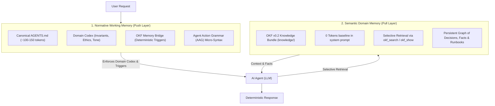
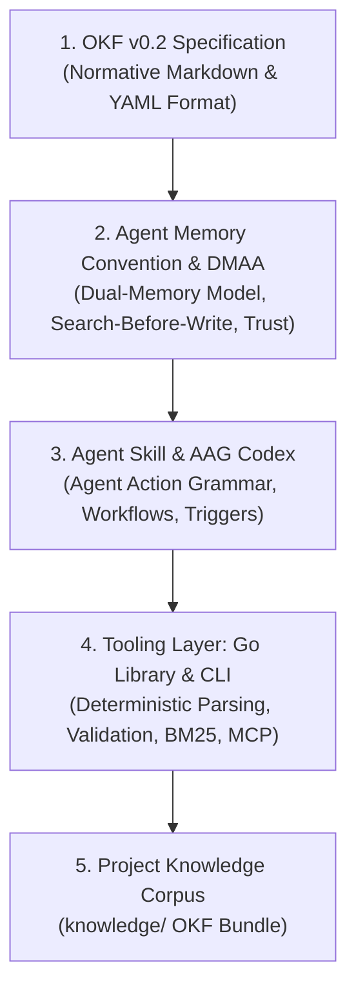

# OKF Agent Memory

> **A Domain-Neutral, Git-Native Persistent Project Memory for AI Agents based on the Open Knowledge Format (OKF) v0.2.**

[](https://github.com/GoogleCloudPlatform/knowledge-catalog/blob/main/okf/SPEC.md)
[](pkg/okf)
[](https://github.com/okf-memory/okf-agent-memory/actions/workflows/ci.yml)
[](https://trendshift.io/repositories/215663)
[](cmd/okf)
[](LICENSE)
[](https://github.com/sponsors/sknr)

---

## 🌟 Overview

Conversations with AI agents reset when context windows close. Valuable architectural decisions, domain discoveries, and operational facts are lost unless stored persistently.

Traditional approaches suffer from two fatal failure modes:
1. **The Prompt Monolith**: Stuffing all domain knowledge and rules into `AGENTS.md` or `CLAUDE.md` creates massive context bloat and causes **attention drift** (agents ignore critical instructions).
2. **The RAG Blindspot**: Dumping behavioral rules into vector databases fails because agents never semantically search for operational constraints (e.g. formatting or security rules) during general tasks.

**OKF Agent Memory** resolves this dilemma with the **Dual-Memory Agent Architecture (DMAA)**:



### The Universal Composition Model

In DMAA, every agent configuration is structured by a universal composition:

$$\text{AGENTS.md} = \underbrace{\text{Domain Codex (AAG)}}_{\text{Project Invariants, Tone, Guardrails}} + \underbrace{\text{OKF Memory Bridge}}_{\text{Standardized Triggers: Search-Before-Write}}$$

* **Layer 1: Normative Working Memory (Push Layer)**: A permanent, ultra-compact behavioral codex (~100–150 tokens) expressed in [**Agent Action Grammar (AAG)**](docs/spec/AGENT_ACTION_GRAMMAR_RFC.md). Loaded at session start, enforcing zero-tolerance invariants.
* **Layer 2: Semantic Domain Memory (Pull Layer)**: An [**OKF v0.2**](https://github.com/GoogleCloudPlatform/knowledge-catalog/blob/main/okf/SPEC.md) knowledge bundle (`knowledge/`) that consumes **0 tokens at baseline** and is queried on-demand in microseconds.



---

## ⚡ Key Highlights

* **Dual-Memory Cognitive Architecture (DMAA)**: Separates normative push working memory (`AGENTS.md` codex) from semantic pull domain memory (`knowledge/` bundle), completely eliminating prompt bloat.
* **Agent Action Grammar (AAG)**: Ultra-compact, deterministic ASCII micro-syntax saving **~78–85% tokens** compared to natural language prompt instructions.
* **Blazing Fast Performance (<300µs Search, ~4ms Graph Validation)**: In-memory BM25 retrieval and bundle validation execute in microseconds without VM spin-up or network roundtrips.
* **100% Git-Native & Zero Vendor Lock-in**: Everything is version-controlled plain text. Inspect, audit, and review your agent's memory using standard `git diff` and `git log`. No external database required.
* **Zero API Costs for Memory Retrieval**: Local lexical BM25 indexing eliminates recurring vector embedding API costs and network roundtrips.
* **Built on Google OKF v0.2**: Uses the open standard format for agent knowledge with full support for provenance (`sources`), trust tiers (`generated` vs. `verified`), and lifecycle metadata (`status`, `stale_after`).
* **Solves Context Bloat & Memory Rot**: Employs **Progressive Disclosure** (hierarchical `index.md` files and link graphs) so agents only load the exact concepts they need.
* **Search-Before-Write Principle**: Mandates querying existing memory before authoring, preventing concept duplication and hallucinated divergence.
* **Governance & Code-to-Knowledge Binding**: Bind architecture decisions directly to source files via `code_refs` and query active constraints/holds via `--for-path` before modifying code.
* **Truly Domain-Neutral**: Designed for Software Engineering, Coaching, Scientific Research, Literature Reviews, and Operations.

---

## 📊 Performance Benchmarks

Built in Go with zero external dependencies, `okf` is engineered for high-frequency agent tool calling loops:

| Benchmark Metric | Python / Vector DB Runtimes (Mem0, Letta) | Deno / Node.js Tooling | **OKF Agent Memory (Go)** |
| :--- | :--- | :--- | :--- |
| **Concept Search Latency** | 150ms – 800ms (Embedding API + Vector DB) | 40ms – 120ms | **< 300 µs (Microseconds, In-Memory BM25)** |
| **Full Corpus Parse & Graph Validation** | 200ms – 1.5s | 80ms – 250ms | **~4.0 ms (50+ concepts, bidirectional graph)** |
| **Process Cold-Start Overhead** | 250ms – 600ms (Python VM boot) | 80ms – 180ms (V8 / Deno boot) | **< 4 ms (Compiled Single Binary)** |
| **Retrieval Cost per 1,000 Queries** | ~$0.10 – $0.50 (Embedding tokens) | $0.00 | **$0.00 (Zero API cost, fully local)** |
| **Memory Footprint (RSS)** | ~120 MB – 350 MB | ~60 MB – 140 MB | **< 15 MB** |

> [!TIP]
> **Reproduce Locally with your own LLM**: We provide an automated benchmark runner in pure Go to verify Time-To-First-Token (TTFT) speedups and -80% token reduction on your local hardware (LM Studio / Ollama with Gemma, Qwen, Llama). Run `make benchmark` or explore the [Progressive Disclosure Benchmark Suite](benchmarks/).

---

## 🚀 Quickstart

### 1. Build the Tooling

Clone the repository and compile the standalone `okf` executable:

```bash
make build
```

This generates the standalone binary at `bin/okf`.

### 2. Basic CLI Commands

```bash
# Validate bundle conformance, graph connectivity, and description drift
./bin/okf validate knowledge --strict --drift

# Search concepts via in-memory BM25 scoring
./bin/okf search "architecture layers" knowledge

# Discover constraints and active holds governing a specific source file before editing
./bin/okf search --for-path pkg/okf/types.go knowledge

# Inspect a concept and its relationships (with --json support)
./bin/okf show architecture/layers knowledge --json

# Create a new concept with automated log.md and index.md bookkeeping
./bin/okf create decisions/auth-flow knowledge \
  --type Decision \
  --title "OAuth2 Authorization Flow" \
  --desc "Standardized on PKCE for client authentication."

# Update an existing concept
./bin/okf update decisions/auth-flow knowledge \
  --desc "Updated OAuth2 PKCE token refresh interval."

# Bootstrap full agent memory stack into any target project
./bin/okf bootstrap /path/to/project --name "My Project"

# Initialize only a bare OKF bundle in any directory
./bin/okf init my-project/knowledge

# Zero-Knowledge Sync: initialize vault and print Emergency Kit
./bin/okf hub init-vault knowledge

# Zero-Knowledge Sync: push or sync changes with the Hub (optional: --token or OKF_HUB_TOKEN)
./bin/okf hub push knowledge --password "pass" --secret-key "XXXX-..." --auth-token "my-token"
./bin/okf hub sync knowledge --password "pass" --secret-key "XXXX-..."

# Optional Git sync (no backend, your remote is the transport):
# enable once, then every write validates, commits and pushes automatically
./bin/okf sync init knowledge
git remote add origin git@github.com:you/your-repo.git   # plain Git, sync never touches remotes
```

### 3. Bootstrapping Agent Memory in Any Project

Scaffold the complete OKF Agent Memory architecture into any new or existing repository with a single command:

```bash
# Bootstrap full memory stack into target project
./bin/okf bootstrap /path/to/my-project --name "My Service"
```

This automatically sets up:
* `knowledge/` — OKF v0.2 compliant persistent memory bundle (`index.md`, `log.md`)
* `.agents/skills/okf-memory/` — Embedded agent skill definition and capability guides
* `AGENTS.md` — Project-tailored operating instructions for AI coding agents
* `Makefile` — Convenience tasks for validation (`make validate`) and search (`make search q="..."`)

### 4. Running as an MCP Server

`okf` ships with a native Model Context Protocol (MCP) server over `stdio` to seamlessly connect with Claude Code, Cursor, Codex, and other agent platforms:

```bash
./bin/okf mcp knowledge
```

#### Example MCP Configuration (`claude_desktop_config.json` or Cursor):
```json
{
  "mcpServers": {
    "okf-memory": {
      "command": "/path/to/okf-agent-memory/bin/okf",
      "args": ["mcp", "/path/to/project/knowledge"]
    }
  }
}
```

---

## 📂 Repository Structure

```
okf-agent-memory/
├── .agents/                # Active agent skills and agent configuration
│   └── skills/okf-memory/  # Authoritative OKF memory skill for AI agents (Single Source of Truth)
├── benchmarks/             # Progressive disclosure benchmark suite & hardware test data
│   ├── data/               # Monolith docs vs OKF bundle test fixtures
│   └── results/            # Reproducible benchmark logs across 8+ local & cloud LLMs
├── cmd/
│   ├── okf/                # Standalone CLI and embedded MCP server (`stdio`)
│   └── okf-benchmark/      # Automated benchmark runner for LLM TTFT & token measurements
├── docs/                   # Guides, specifications, architecture & release playbook
│   ├── README.md           # Central documentation index & navigation
│   ├── guides/             # User guides, CLI/MCP reference & AI instruction best practices
│   ├── spec/               # OKF convention v0.1, compatibility analysis & architecture RFCs
│   ├── security/           # Data governance, secret prevention & adversarial security audits
│   ├── project/            # Project roadmap, release playbook & multi-agent testing
│   └── releases/           # Versioned release notes & changelog archive (v0.1.0 – v0.4.2)
├── examples/               # Domain-neutral reference DMAA projects (AGENTS.md + OKF v0.2 knowledge/)
│   ├── books/              # Literature & editorial analysis repository
│   ├── coaching/           # Executive coaching & client session repository
│   └── software/           # Microservices architecture & ADR engineering repository
├── knowledge/              # Project's own OKF v0.2 persistent memory bundle
│   ├── index.md            # Root progressive disclosure index (okf_version: "0.2")
│   ├── log.md              # Dated change log (ISO 8601 YYYY-MM-DD)
│   ├── project/            # Overview & value propositions
│   ├── architecture/       # 5-tier architecture, governance model & decisions
│   ├── convention/         # Principles & lifecycle workflows
│   └── roadmap/            # Milestones
├── packaging/              # Distribution packaging
│   └── homebrew/           # Official Homebrew formula & tap instructions
├── pkg/okf/                # Zero-dependency Go core library (parser, validator, BM25, MCP, bootstrap)
│   └── assets/             # Embedded bootstrap templates & skills mirrored via `make sync-assets`
├── scripts/                # Verification & automated audit review helpers (e.g. Jules integration)
├── AGENTS.md               # Operating instructions for AI coding agents
├── CONTRIBUTING.md         # Contribution guidelines & development workflow
├── CONTRIBUTORS.md         # Community contributors & acknowledgements
├── CODE_OF_CONDUCT.md      # Contributor Covenant v2.1 code of conduct
├── Makefile                # Build, test, lint, validation & release targets
├── LICENSE                 # MIT License
├── README.md               # Main repository documentation
└── SECURITY.md             # Security policy & reporting guidelines
```

---

## 🧪 Testing & Verification

Run the full test suite and validate the repository's self-documenting knowledge bundle:

```bash
make check
```

---

## 📖 Further Documentation

* [Documentation Index](docs/README.md) - Central directory of all project documentation.
* [Getting Started Guide](docs/guides/GETTING_STARTED.md) - Comprehensive onboarding guide for agents and humans.
* [CLI & MCP Reference](docs/guides/CLI.md) - Complete command-line and protocol tools reference.
* [Git Sync Guide](docs/guides/SYNC.md) - Optional, automatic, backend-free Git synchronization and multi-agent conflict semantics.
* [Dual-Memory Agent Architecture RFC](docs/spec/DUAL_MEMORY_AGENT_ARCHITECTURE_RFC.md) — Cognitive 2-layer agent memory model (Push codex + Pull knowledge).
* [Agent Action Grammar RFC](docs/spec/AGENT_ACTION_GRAMMAR_RFC.md) — Deterministic, token-efficient AAG micro-syntax specification for `AGENTS.md`.
* [Agent Instruction Best Practices](docs/guides/AGENT_INSTRUCTION_BEST_PRACTICES.md) — Guide to deterministic instruction design and token optimization.
* [OKF Agent Memory Convention v0.1](docs/spec/CONVENTION.md) — Behavioral rules and lifecycle specification.
* [Contributing Guide](CONTRIBUTING.md) — Development setup, quality gates, and pull request standards.
* [Security & Privacy Guidelines](docs/security/SECURITY.md) — Data governance, secret prevention, and PII protection rules.
* [Multi-Agent Testing & Evaluation](docs/project/AGENT_TESTING.md) — Test scenarios, compatibility matrix, and benchmarks.
* [Project Roadmap & Milestones](docs/project/ROADMAP.md) — Phased development plan.
* [Release Playbook](docs/project/playbooks/RELEASE_PLAYBOOK.md) — Versioning, CI/CD pipeline, and distribution procedures.
* [Release Notes & History](docs/releases/README.md) — Versioned changelogs and historical release notes archive.
* [OKF v0.2 Compatibility Matrix](docs/spec/OKF-COMPATIBILITY.md) — Specification validation analysis.
* [Why OKF Agent Memory?](knowledge/project/value-proposition.md) — Detailed value proposition & differentiators.
* [Alternatives & Ecosystem Comparison](docs/project/ALTERNATIVES.md) — Comparison with Mem0, Letta, and ad-hoc markdown files.

---

## 👥 Contributors

Thank you to all the wonderful contributors who have helped build and refine OKF Agent Memory!

<a href="https://github.com/okf-memory/okf-agent-memory/graphs/contributors">
  
</a>

Contributions of all kinds are warmly welcomed! See [CONTRIBUTING.md](CONTRIBUTING.md) and [CONTRIBUTORS.md](CONTRIBUTORS.md) for details.

---

## 💖 Support & Sponsoring

If you find **OKF Agent Memory** valuable for your autonomous agent workflows, consider [sponsoring the project on GitHub](https://github.com/sponsors/sknr) to help support continuous development, security hardening, and spec compliance!

---

## 📄 License

MIT License. See [LICENSE](LICENSE) for details.
