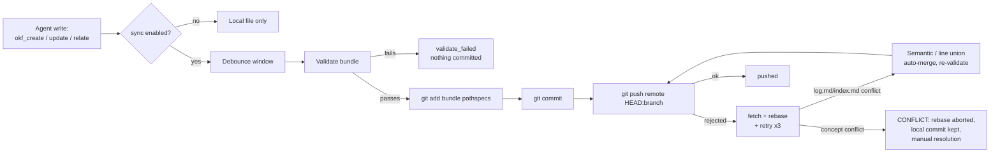

# Optional Git Sync — Automatic, Backend-Free

> **Design contract:** without sync enabled, a plain directory (Git or not) is a
> fully valid memory and nothing changes. With sync enabled, synchronization is
> **automatic**: writes are validated, committed and pushed without being
> asked. There is no backend, no hub, no service — only the user's own Git
> remote (GitHub or otherwise).

`okf sync` is the counterpart to `okf hub`: the hub is a zero-knowledge
encrypted vault server; **Git sync uses the repository you already have**.
For teams that live on GitHub, the remote is the transport, the coordination
point and the history all at once.

---

## 1. The two modes

### Off (default)

No `.okf-sync.json` in the bundle. Every command behaves exactly as before:

- no Git repository is required;
- `okf create/update/relate` and the MCP tools write files, nothing else;
- `okf sync status` explains that sync is off — that is all.

Nothing is staged, committed or pushed. `okf-agent-memory` keeps working on a
memory stick with no Git installed.

### On

A `.okf-sync.json` inside the bundle (next to `log.md`, skipped by bundle
loading) enables automation for **every** agent that has the repository
checked out — the config travels with the repo:



At session start (MCP `initialize`, or `okf sync refresh` by hand) the bundle
is brought up to date from the remote in the background, so a long session
starts from fresh knowledge.

## 2. Enabling it

```bash
# In a project (bundle is knowledge/, repository is the project root):
okf sync init

# Standalone memory (creates a Git repo in the bundle itself):
okf sync init ~/memoria

# With choices:
okf sync init knowledge --agent agent/codex --no-auto-pull
```

`sync init`:

1. finds the nearest Git repository (walking up from the bundle); if the
   bundle is standalone, runs `git init -b main` in the right place
   (a `knowledge/` bundle gets the project root as its repo; anything else
   *is* the repo);
2. writes `.okf-sync.json` into the bundle;
3. never touches remotes — adding one stays plain Git:

```bash
git remote add origin git@github.com:you/memory.git
```

From this moment every write publishes automatically.

### The config file

`knowledge/.okf-sync.json`:

| Field | Default | Meaning |
|---|---|---|
| `enabled` | `true` | Master switch (`okf sync enable/disable` flips it) |
| `remote` | `"origin"` | Which Git remote to publish to |
| `branch` | current / `main` | Published branch; commit happens on it only |
| `agent_id` | `agent/<hostname>` | Commit attribution, per machine |
| `auto_pull` | `true` | Refresh from remote at MCP session start |
| `auto_push` | `true` | Validate + commit + push after every write |
| `strict_validate` | `false` | Also gate on the strict producer gate (orphans, broken links) |
| `debounce_ms` | `1500` | MCP write batching window (CLI publishes immediately) |
| `extra_paths` | `[]` | Extra repo-relative paths allowed to be staged (e.g. `["AGENTS.md"]`) |

Environment:

| Variable | Effect |
|---|---|
| `OKF_SYNC_DISABLE=1` | Kill switch: all automation off, everywhere |
| `OKF_SYNC_AGENT_ID` | Override the commit identity without editing the committed config |

## 3. Multi-agent concurrency

Optimistic concurrency, like the rest of Git. Two agents that cloned the same
memory repo and write at the same time:

1. **Different concepts** — both land. The second agent's push is rejected,
   sync fetches, rebases, and pushes again. `log.md` conflicts are merged
   with the same semantic union used by hub sync (both `**Create**` entries
   survive); `index.md` conflicts merge as a line-level union. The merged
   bundle is re-validated before the push.
2. **Same concept** — a real knowledge conflict. Sync never picks a winner:
   the rebase is aborted, the local commit survives, and the result reports
   `state: "conflict"` with the disputed files. The author (human or agent)
   resolves with plain Git and publishes again.

Fail-closed rules:

- only the bundle pathspec (+ `extra_paths`) is ever staged — unrelated dirty
  files never ride along;
- the bundle must validate before the commit is created;
- the merged result must validate before the push;
- the published branch is **never force-pushed**;
- a clean tree is not "nothing to do": unpushed local commits (a conflict
  resolved by hand, a previously failed push) are published too.

### Where each conflict kind lands

| Conflict | Resolution |
|---|---|
| Different files | Automatic (rebase + push) |
| `log.md` | Automatic (semantic union, same as hub sync) |
| Any `index.md` in the bundle | Automatic (line union, re-validated before push) |
| Same concept file | **Manual** — reported, rebase aborted, nothing lost |

## 4. Commands and tools

CLI:

```bash
okf sync init [bundle] [--remote origin] [--branch main] [--agent id]
              [--no-auto-pull] [--no-auto-push]
okf sync status  [bundle] [--json]   # enabled? branch? dirty? ahead/behind?
okf sync refresh [bundle] [--json]   # fetch + fast-forward/rebase
okf sync publish [bundle] [--message "subject"] [--json]
okf sync enable  [bundle]
okf sync disable [bundle]
```

MCP tools (visible to every agent, regardless of sync state):

- `okf_sync_status` — honest report, always safe to call;
- `okf_sync_refresh` — force a refresh on demand;
- `okf_sync_publish` — force a publish on demand.

Automatic behavior is per-config, not per-tool: CLI writes publish
immediately; MCP writes batch within `debounce_ms` and publish at the timer
or at server shutdown, whichever comes first — a session's last write is
never lost.

## 5. States, honestly reported

Every publish answers with one state, in CLI text, MCP structured content
and stderr logs alike:

| State | Meaning |
|---|---|
| `pushed` | Validated, committed and pushed |
| `local_committed` | Committed; the configured remote does not exist yet |
| `local_only` | Sync not active (off, no Git, or kill switch) — the original behavior |
| `nothing_to_do` | Nothing dirty and nothing unpushed |
| `conflict` | Remote changed the same concept; manual resolution needed, local commit preserved |
| `validate_failed` | Validation findings; nothing was committed or pushed |
| `wrong_branch` | Checked-out branch differs from the configured published branch |

## 6. Git sync vs. hub sync

| | `okf sync` (Git) | `okf hub` |
|---|---|---|
| Transport | Your Git remote (GitHub, GitLab, bare repo, SSH) | OKF Memory Hub server |
| Credentials | Your existing Git auth (SSH, credential manager) | Vault password + key |
| Encryption | None beyond what the remote gives you (use a private repo) | Client-side, zero-knowledge |
| History | Plain Git history, reviewable in PRs | CAS commit graph |
| Multi-agent | Rebase + auto-merge, fail-closed | Server-side CAS + conflict files |
| Backend required | No | Yes (`okf hub serve`) |

Use Git sync when the repository is the system of record — code and memory
reviewed together, agents as collaborators on GitHub. Use the hub when the
memory must stay encrypted from the storage itself.
