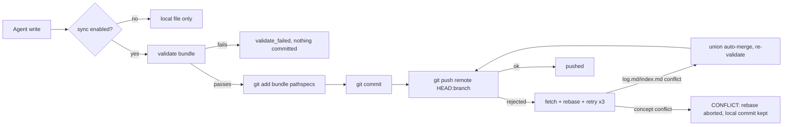

# Optional Git Synchronization via Plain Git (No Backend)

## Context & Purpose

The hub is a synchronization **backend**. Many users already have a system of record they trust more than any service: their Git remote (GitHub, GitLab, a bare repo on a LAN). This fork adds `okf sync`: opt-in synchronization where the user's own remote is the transport, the coordination point and the history. Nothing else is introduced — no server, no encryption ceremony, no new credentials beyond the Git auth the machine already has.

## Design Contract

The contract has two halves and the first one is the reason this is a fork:

1. **Sync is optional.** Without a `.okf-sync.json` inside the bundle, every command behaves exactly as before: a plain directory with no Git repository is a fully valid memory. `okf create/update/relate` and every MCP tool stay pure local file operations.
2. **Enabled means automatic.** With the config present, every write is validated, committed and pushed without being asked; MCP sessions start by refreshing the bundle from the remote in the background.

The config lives inside the bundle (skipped by loading, committed with the repo), so every agent that clones the repository inherits the same sync policy. `OKF_SYNC_AGENT_ID` per machine keeps commit attribution honest while the policy stays shared.

## Publish Cycle

## Multi-Agent Semantics

Concurrency is optimistic, exactly like Git itself:

* **Different concepts** — both land. The rejected push triggers fetch + rebase; `log.md` conflicts merge with the same semantic union used by hub sync, `index.md` conflicts merge as a line-level union, and the merged bundle is re-validated before the push.
* **Same concept** — a knowledge conflict is never auto-resolved. The rebase is aborted, the local commit survives unpublished, and the publish result reports `state: conflict` with the disputed files for manual resolution.

Fail-closed invariants: only the bundle pathspec (+ configured `extra_paths`) is staged; validation gates both the commit and the post-merge push; a clean tree still publishes unpushed commits; the published branch is never force-pushed.

## Relationship to Hub Sync

`okf sync` and `okf hub` are complementary transports, not competitors. Git sync is the right default when the repository is the system of record — code and memory reviewed together, agents as GitHub collaborators. The zero-knowledge hub remains the answer when the memory must stay encrypted from the storage itself.

## Related Concepts

- [Zero-Knowledge Vault Cryptography and Blind Sync Architecture](zero-knowledge-vault-sync.md): the encrypted alternative transport
- [5-Layer System Architecture](layers.md): where the sync layer sits
- [Bundle Isolation and Mutation Security Boundaries](security-boundaries.md): path confinement reused by staging rules
