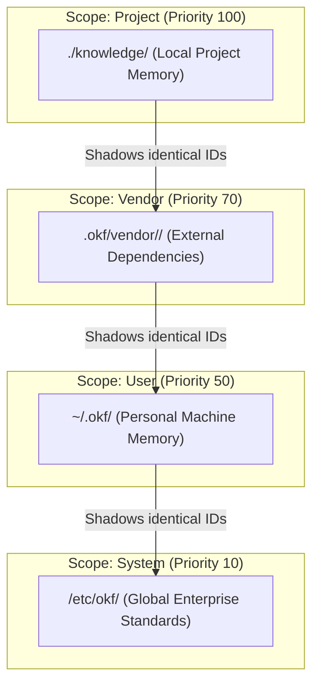

## Context & Motivation

As autonomous agents and human developers scale memory across projects, standard domain rules, framework best practices (e.g. Next.js, Django), and organizational standards must be shared without manual copy-pasting or repository pollution.

This architectural decision codifies the decentralized OKF Registry distribution model, the zero-dependency `okf.lock` manifest format, multi-scope prioritization semantics, and hermetic `@` cross-scope linking.

---

## 1. Multi-Scope Hierarchy & Priority Weighting

OKF Agent Memory evaluates concepts across multiple discrete scopes, prioritizing local project context while enabling seamless upstream dependency inheritance:



* **Shadowing Invariant**: Local project concepts (`priority: 100`) strictly shadow vendor concepts (`priority: 70`), which in turn shadow user concepts (`priority: 50`) and system concepts (`priority: 10`) of the same relative ID.
* **Composite BM25 Indexing**: Searches across scopes combine document frequencies while strictly sorting by layer priority.
* **Scope Specification Matrix**:

| Scope | Link / Reference Syntax | Canonical URN | Storage Location | Priority | Precedence & Behavior |
| :--- | :--- | :--- | :--- | :--- | :--- |
| **`project`** | `decisions/routing.md` | *(bundle relative)* | `./knowledge/` | **100** | Authoritative local project memory. Strictly shadows identical IDs across vendor, user, and system layers. |
| **`vendor`** | `@nextjs-15/routing.md`<br/>`@peter/django-rules/auth.md` | `okf://@nextjs-15/routing`<br/>`okf://@peter/django-rules/auth` | `.okf/vendor/<bundle>/` | **70** | External packages pulled via `okf pull`. Strictly shadows user and system layers. |
| **`user`** | `user:guidelines/style.md` | `okf://user/guidelines/style` | `~/.okf/` | **50** | Personal developer preferences and cross-project notes. Strictly shadows system layer. |
| **`system`** | `system:corp/policies.md` | `okf://system/corp/policies` | `/etc/okf/` | **10** | Machine-level and enterprise compliance standards. |

* **Layer-Filtered Search (`--scope`)**: `okf search` supports `--scope <all|project|bundle|vendor|user|system>` (default: `all`).

---

## 2. Registry Client & Package Resolution

The client communicates with the canonical OKF Registry (`https://registry.okf-memory.dev`) or custom private registries specified via `--registry <url>` or `OKF_REGISTRY_URL`:

* **Identifier Resolution**:
  * Scoped Packages: `@org/bundle` (e.g. `@acme/security-rules`)
  * Top-Level Packages: `bundle` (e.g. `nextjs-15`)
  * Version Pinning: `@vX.Y.Z` or `@tag` (e.g. `nextjs-15@1.2.0`)
  * Direct Git URLs: `github.com/org/repo@vX.Y.Z`
* **Knowledge Directory Promotion**: For DMAA repository archives that package memory under `knowledge/`, the extractor automatically stream-filters and promotes `knowledge/` contents directly to `.okf/vendor/<bundle-id>/` without root directory pollution or disk churn.
* **Integrity & Rollback**: Archives are verified against SHA-256 integrity hashes. Downloaded bundles are strictly validated (`okf validate`); any validation failure triggers an immediate, atomic rollback.

---

## 3. Zero-Dependency Lockfile (`okf.lock`)

Dependency versions and cryptographic hashes are locked in `okf.lock` using a deterministic, human-readable YAML structure parsed and emitted without external dependencies:

```yaml
version: 1
bundles:
  - id: nextjs-15
    source: https://registry.okf-memory.dev/tarballs/nextjs-15-1.0.0.tar.gz
    version: 1.0.0
    hash: 5f4dcc3b5aa765d61d8327deb882cf99...
    installed_at: 2026-10-01T10:00:00Z
```

* **Deterministic CLI Operations**:
  * `okf pull [<bundle-id>]`: Resolves, downloads, extracts, validates, and locks the dependency.
  * `okf restore`: Restores and verifies all dependencies in `okf.lock` in clean environments.
  * `okf vendor list`: Lists installed vendor bundles.
  * `okf vendor remove <bundle-id>`: Uninstalls the vendor bundle and cleans `okf.lock`.

---

## 4. Hermetic Cross-Scope Linking (`@` Prefix)

To prevent broken link warnings and maintain unambiguous boundaries between local and external knowledge:

* **Markdown Link Syntax**:
  * Scoped Vendor Bundle: `@peter/django-5-rules/decisions/auth.md`
  * Top-Level Vendor Bundle: `@nextjs-15/decisions/routing.md`
  * User Memory: `user:guidelines/style.md`
  * System Memory: `system:corp/policies.md`
* **Canonical URI Scheme**:
  * Vendor: `okf://@nextjs-15/decisions/routing`
  * User: `okf://user/guidelines/style`
  * System: `okf://system/corp/policies`
* **Strict Disambiguation & Validator Rules**:
  * References with a leading `@` resolve strictly to `.okf/vendor/`.
  * References with `user:` and `system:` resolve to user (`~/.okf/`) and system (`/etc/okf/`) layers.
  * References without prefix (e.g. `decisions/routing.md`) resolve strictly to the local project bundle (`knowledge/`).
  * Bundle validation (`okf validate --strict`) recognizes all external references (`@`, `user:`, `system:`, `okf://`, `https://`) without failing or emitting broken link errors, and avoids false-positive orphan detection for concepts referencing external knowledge.

---

## Related Concepts

- [5-Layer System Architecture](layers.md): Layered separation of concerns
- [Bundle Isolation and Mutation Security Boundaries](security-boundaries.md): Defensive containment and path traversal protection
- [Go Single-Binary CLI & MCP Architecture Decision](tooling-decision.md): Zero-dependency tooling architecture
