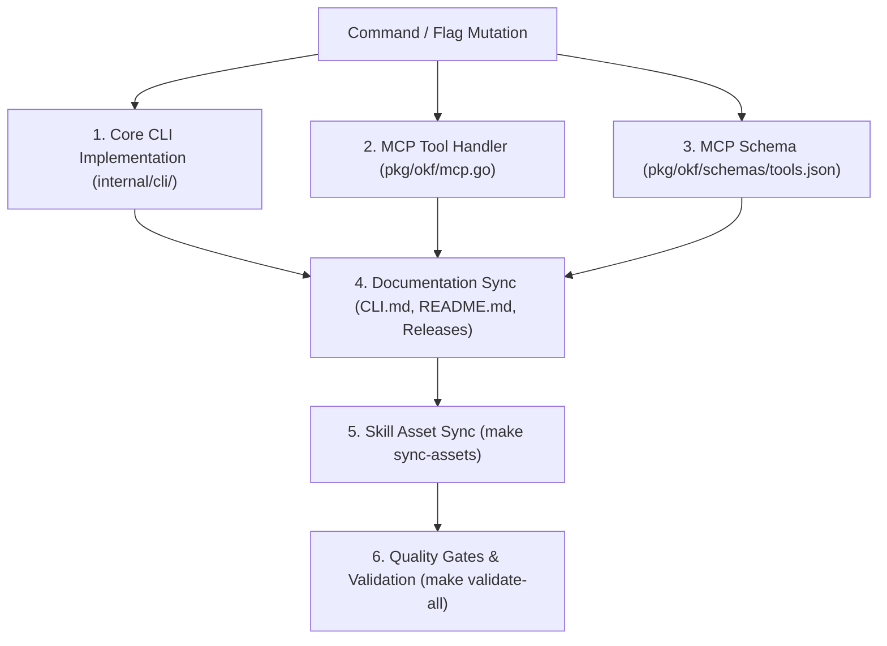

## Context & Purpose

When adding, modifying, or extending CLI commands, flags, positional arguments, or MCP tools in `okf-agent-memory`, agents must ensure total behavioral parity, documentation synchronization, schema conformance, and security boundary protection.

This checklist serves as the mandatory gate pipeline for all command mutations.

---

## 1. Core CLI Implementation (`internal/cli/`)

- [ ] **Argument Boundary**: Conform strictly to the [CLI Optional Path Boundary](../architecture/cli-argument-boundary.md) convention (`splitOptionalPath`), ensuring optional bundle paths are separated from command flags.
- [ ] **In-Binary Help Text**: Update the command-specific `print<Command>Usage()` function with updated flags, syntax, and realistic examples.
- [ ] **Global Help Registry**: Update `printUsage()` in `internal/cli/root.go` if a new command or major subcommand was introduced.
- [ ] **Strict Exit Codes**:
  - `0`: Successful execution.
  - `1`: User input, flag parsing, or validation error.
  - `2`: Bundle load failure, corrupt state, or catastrophic error.
- [ ] **Machine-Readable JSON Output**: If the command supports `--json`, ensure deterministic, indented output matching the structured Go types.

---

## 2. MCP Server & Tool Handlers (`pkg/okf/mcp.go`)

- [ ] **CLI/MCP Feature Parity**: Ensure every read/query/mutate capability added to the CLI is equally accessible to agents via native `okf_*` MCP tools.
- [ ] **Tool Call Dispatcher**: Extract and validate all arguments in `handleToolCall`, enforcing string lengths, slice limits, and character invariants.
- [ ] **Security Boundaries**:
  - Path traversal protection: Always validate concept IDs with `ValidateConceptID`.
  - Confinement checks: Enforce root directory confinement via `s.resolveBundleDir` where paths are passed.
  - Scoped routing: Use `ResolveScopedConcept` and `SearchLayered` for cross-scope memory resolution.

---

## 3. Embedded MCP Tool Schemas (`pkg/okf/schemas/tools.json`)

- [ ] **Input Schema (`inputSchema`)**:
  - Declare every parameter with exact `type`, `description`, and `enum` where applicable.
  - Mark only non-defaultable parameters in `required`.
- [ ] **Output Schema (`outputSchema`)**:
  - MCP clients require a root `type: "object"`.
  - Update `properties` to reflect all fields returned in structured results.
  - Update `required` properties inside result envelopes.

---

## 4. User Documentation & Release Notes

- [ ] **CLI Manual (`docs/guides/CLI.md`)**: Document syntax, flags, default values, priority tables, and real-world examples.
- [ ] **Getting Started (`docs/guides/GETTING_STARTED.md`)**: Update onboarding workflows if default commands changed.
- [ ] **Project README (`README.md`)**: Update command tables and summary cheat-sheets.
- [ ] **Release Notes (`docs/releases/vX.Y.Z.md`)**: Document new features, enhancements, and flags.
  - *Invariant*: Never credit the project's own agent or bot accounts in contributors or release notes. Credit external reporters and contributors by handle, whether or not an agent files their report.

---

## 5. Agent Instructions & Skills

- [ ] **Skill Definition (`pkg/okf/assets/skill/SKILL.md`)**: If agent workflow instructions or tool call signatures changed, update the canonical skill assets.
- [ ] **Asset Propagation**: Run `make sync-assets` to synchronize embedded skill files to `.agents/skills/` and IDE customization paths.

---

## 6. Testing & Quality Assertion Gates

- [ ] **CLI Unit Tests (`internal/cli/*_test.go`)**:
  - Test all flags, argument permutations, and invalid input error handling.
  - Test exit codes and stderr messages on failures.
- [ ] **MCP Unit Tests (`pkg/okf/mcp_test.go`)**:
  - Schema presence tests: Verify `TestMCPToolsListOutputSchemas` and input properties.
  - Functional tests: Verify JSON-RPC tool calls, error envelopes (`isError: true`), and boundary denial.
- [ ] **Automated Quality Pipeline**:
  - Run `make fmt && make vet && make lint`.
  - Run `make validate-all` (ensuring 0 errors, 0 warnings, strict conformance).
  - Run `go test ./...`.

---

## Related Concepts

- [CLI Optional Path Boundary](../architecture/cli-argument-boundary.md)
- [Go Single-Binary CLI & MCP Architecture Decision](../architecture/tooling-decision.md)
- [MCP Tool Security & Untrusted Agent Input](mcp-agent-safety.md)
- [Engineering & Coding Best Practices](coding-standards.md)
